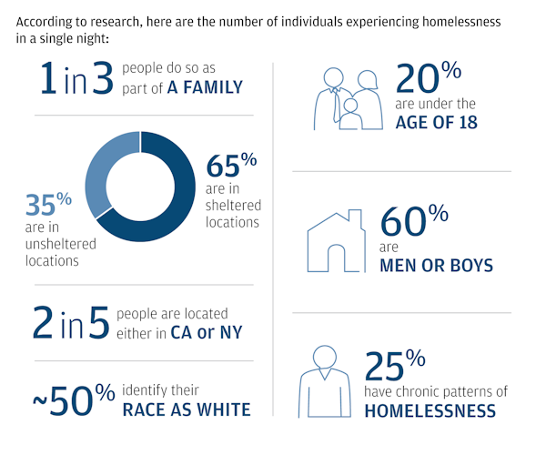

# Youth Homelessness SSI Reform Act (YHSRA)

**Legislative Proposal to Remove Barriers to Education for Homeless Youth Receiving SSI/SSDI Benefits**

## Section 1: Short Title
This Act may be cited as the "Youth Homelessness SSI Reform Act" (YHSRA).

## Section 2: Findings
Congress recognizes that:

- Over 4,500 homeless youth exist in Washington state ([2024 Point-in-Time Count](https://kcrha.org/wp-content/uploads/2025/05/Point-in-Time-Count-2024_King-County_final.pdf)).
- 44% of these youth have qualifying disabilities.
- Current SSI/SSDI rules ([42 U.S.C. §1382](https://www.law.cornell.edu/uscode/text/42/1382)) penalize homeless youth by:
  - Terminating or reducing benefits if recipients earn >$1,971/month (2024) or attend school >8 hours/week.
  - Forcing an impossible choice between basic survival (benefits) and self-sufficiency (education).
- These policies perpetuate cycles of homelessness, costing taxpayers $35,000+/year per person in emergency services ([Study on Homelessness Costs](https://pmc.ncbi.nlm.nih.gov/articles/PMC8863642/)).

## Section 3: Key Reforms

### (a) SSI/SSDI Education Exemption
Amend [42 U.S.C. §1382a](https://www.law.cornell.edu/uscode/text/42/1382a) to:

- Exempt homeless individuals aged 18–25 from benefit reductions due to:
  - Full-time enrollment in education or vocational programs.
  - Earned income ≤ 200% of the federal poverty level ($30,000/year).
- Sunset exemption at age 26.

### (b) Streamlined Plan to Achieve Self-Support (PASS)
Require the Social Security Administration (SSA) to:

- Automatically enroll homeless SSI/SSDI recipients aged 18–25 in a PASS plan.
- Simplify applications to one page with auto-renewal.

### (c) HUD-SSA Benefit Alignment
Mandate coordination between HUD and SSA to:

- Prohibit federally subsidized housing programs (e.g., Section 8, HUD-VASH) from penalizing SSI recipients enrolled in education or work.
- Align income reporting rules to disregard SSI benefits used for education.

## Section 4: Implementation & Oversight

- **Fiscal Note**: Cost-neutral, funded by reduced chronic homelessness costs.
- **Reporting**: SSA must submit annual reports to Congress tracking:
  - Utilization rates of exemptions.
  - Education completion and employment outcomes.
  - Reduction in HUD/SNAP dependency.
- **Enforcement**: Private right of action with 2x damages + attorney fees for violations.

## Why This Matters for Washington State

| Issue              | Current Reality                              | YHSRA Fix                                |
|--------------------|----------------------------------------------|------------------------------------------|
| **SSI Penalties**  | Youth lose benefits if pursuing GED          | Exempts education enrollment             |
| **Housing Instability** | 32% of WA homeless youth are students   | Shields housing subsidies during school  |
| **Racial Equity**  | 78% of Seattle’s homeless youth are BIPOC   | Targets systemic bias in benefit rules   |

## Supporting Evidence
- 92% of homeless youth who complete job training exit homelessness ([Covenant House, 2023](https://www.covenanthouse.org/)).
- Massachusetts’ RAFT Program successfully waived income caps for students in subsidized housing ([RAFT Program Report](https://www.metrohousingboston.org/about/policy-reports-and-publications/)).
- [Watch YouthCare Testimony Video](https://youtube.com/youthcare-testimony)

## Requested Action from Rep. Jayapal
- Introduce YHSRA as a standalone bill or amendment to the Social Security Act.
- Co-sponsor with:
  - Rep. Adam Smith (D-WA)
  - Rep. Sara Jacobs (D-CA)
  - Sen. Patty Murray (D-WA)
- Hold hearings featuring:
  - [YouthCare](https://youthcare.org) (Seattle-based service provider)
  - [Disability Rights WA](https://www.disabilityrightswa.org)
  - Lived-experience advocates

## Public Comment Invitation
We welcome feedback by **[Insert Date]**:

- What barriers have you witnessed for homeless youth accessing education?
- How could this legislation better address intersectional needs (e.g., BIPOC, LGBTQ+ youth)?
- Suggestions for strengthening enforcement mechanisms?

Submit feedback via [GitHub Issues](https://github.com/username/LegislationDraft2025/issues)